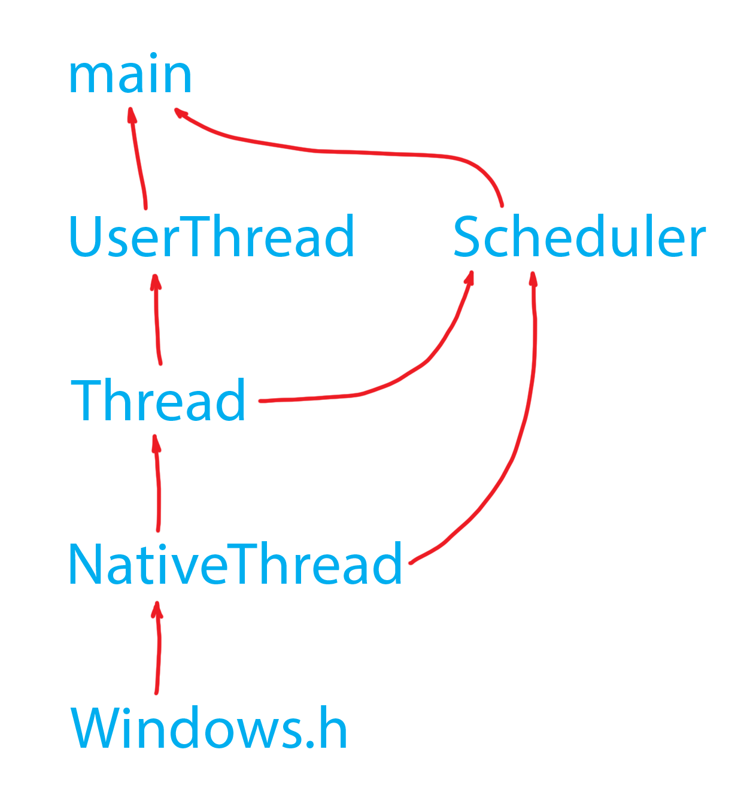

## Scheduler

This scheduler is a written in C++ as a design exercise.

The dividing line in this project is between scheduler's implementation of threads and native threading API that is used to implement context switching.

### Features

- 3 priority levels
- Pre-emption
- Time-slicing

### Implementation

    

### Threads

Scheduler threads (`Thread`) can have 3 priorities:

- High
- Medium
- Low

### Native Threads

#### How it works

The scheduler currently uses Windows threading API to implement switching the execution from one thread to another (context switching or pre-emption) at arbitrary points of time. This works by using 4 native priorities:

- Highest - for the scheduler

- High - for the currently executing thread

- Medium - for the idle thread

- Low - for all the other threads

There's two kind of threads: system and user.

- System threads are the scheduler and the idle thread

- User threads are added to the scheduler with `s.add_thread(Thread&)`

The execution starts with all the user threads assigned the Low priorities. In this state, only the system threads are running. The idle thread is running constantly, except when preempted by the scheduler at regular intervals. The idle thread is used as a stop-gap that's preventing the Windows from running the currently inactive threads.

When the scheduler first decides to start executing a thread, it raises its native priority above the idle thread, which causes the native threading API to run it.

When the scheduler decides to start executing a different thread, it lowers the native priority of the currently running thread and raises the native priority of the new thread.